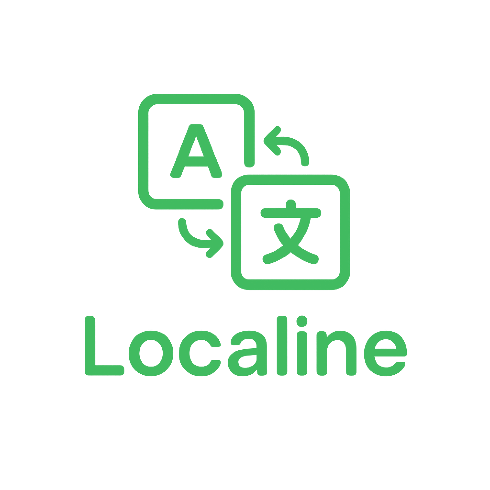

<div align="center">
  
  
  [](https://nextjs.org/)
  [](https://www.typescriptlang.org/)
  [](https://www.gnu.org/licenses/agpl-3.0)
  
  **An open translation management platform for teams**<br>
  **Simple, fast, and developer-friendly.**
  
  [Features](#-features) • [Contributing](#-contributing) • [License](#-license)
</div>

---

## 🚀 Features

- 📁 **Project Management** - Create and manage your translations in multiple independent projects.
- 📝 **Terms & Translations** - A term is a key that is used to assign translations to specific strings.
- 🏷️ **Labels** - Each term can have different labels for better organization (e.g., UI, Notification).
- 👥 **Team Collaboration** - Invite team members with role-based access control.
- 🔄 **Import/Export** - Import and export translations in various formats (e.g., JSON, CSV).
- 🔑 **API Keys** - Generate API keys to interact with translations through your applications.
- 🌍 **Custom Locales** - Add multiple locales to your installation that projects can use.
- 💳 **Plans** – Define different limits for projects by assigning them to different plans.

---

## 🤝 Contributing

Contributions are welcome! Please feel free to submit a Pull Request.

1. [Fork](https://github.com/localineapp/web-app/fork) the repository
2. Clone your fork (`git clone --recurse-submodules https://github.com/your-username/web-app.git`)
3. Create your feature branch (`git checkout -b feat/amazing-feature`)
4. Commit your changes (`git commit -m 'feat: add amazing feature'`)
5. Push to the branch (`git push origin feat/amazing-feature`)
6. Open a Pull Request

### Available Scripts

```bash
npm run dev         # Start development server
npm run build       # Build for production
npm run start       # Start production server
npm run lint        # Run ESLint
npm run format      # Format code with Prettier
npm run typecheck   # Run TypeScript type checking
```

---

## 📝 License

This project is licensed under the GNU Affero General Public License v3.0. See the [LICENSE](LICENSE) file for details.

---

<div align="center">
  Made with ❤️ by <a href="https://github.com/Leon-JavaScript">LeonJS_</a> & <a href="https://github.com/itzmxritz">ItzMxritz</a>
</div>
